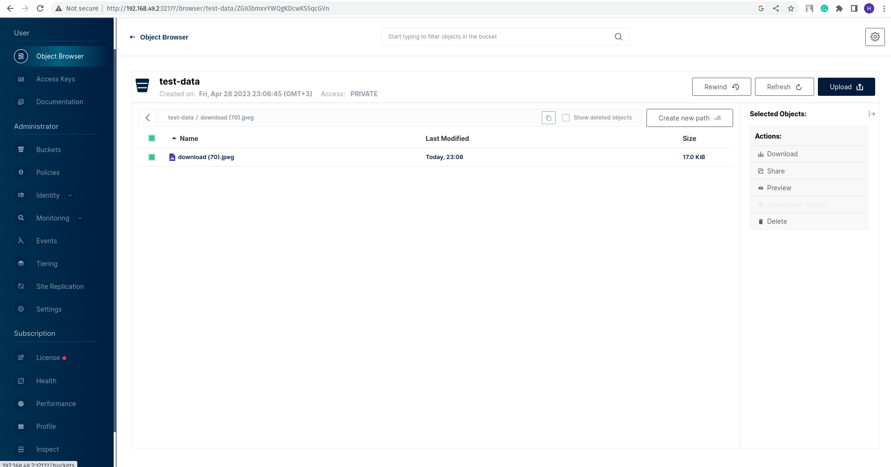

# Machine Learning in Production


## Table of Contents

1. [H2 Infrastructure setup](#infra_setup)
2. [H1 Data storage & processing](#data_minio)
3. [L2 Labeling & versioning](#data_labeling)

## H2 Infrastructure setup
<a name="infra_setup"></a>

Run sh file to build and push docker images ```opetliak/ml_image:latest and opetliak/web_image:latest``` to docker hub : 
``` 
sh run.sh
```

Start minikube cluster:

```
minikube start
```

To create the Pod, run the following command:
```
kubectl apply -f kubernetes/pods/pod.yaml
```

It will sleep forever so we can access it using:

```
kubectl exec -it ml-pod -- bash
```

To create the Job, run the following command:

```
kubectl apply -f kubernetes/jobs/job.yaml
```

If we look at ```kubectl get pod``` we will see that ml-job status is Completed because of ```restartPolicy: Never```


To create the Deployment and Service, run the following command:

```
kubectl apply -f kubernetes/deployments/deployment.yaml
kubectl apply -f kubernetes/services/service.yaml
kubectl get pods # it should show you 3 pods as requested in the yaml
```

To get access outside of the cluster:

```
kubectl port-forward service/ml-service 7080:8080 #or minikube service ml-deployment
```

Go to ```http://localhost:7080/```


Clean up
```
kubectl delete service ml-service
kubectl delete deployment ml-deployment
minikube stop
minikube delete
```

## H1 Data storage & processing
<a name="data_minio"></a>

Create local cluster

```
minikube start
```

Create Persistent Volume Claim for local testing 

```
export MINIO_LOCAL_STORAGE_PATH="/path/to/your/local/minio/storage"
kubectl create -f minio/minio-hostpath-pv.yaml
kubectl create -f minio/minio-pvc.yaml
```

Create Minio Deployment

```
kubectl create -f minio/minio-deployment.yaml
```

Create Minio Service

Possible options: 
- ClusterIP - connection from inside the cluster
- NodePort and LoadBalancer - external traffic

We want to test it outside the cluster

```
kubectl create -f minio/minio-service.yaml
```

Check if everything is correct

```
kubectl get svc minio-service
```

Get the NodePort for the minio Console (in my case it's ```32177```):

```
kubectl get svc minio-service -o jsonpath='{.spec.ports[?(@.name=="console")].nodePort}'
```

Get the IP address of one of the Kubernetes nodes (in my case it's ```192.168.49.2```):

```
kubectl get nodes -o jsonpath='{.items[*].status.addresses[?(@.type=="InternalIP")].address}'
```

Go to ```http://192.168.49.2:32177/login``` and login. 
Here we can create bucket, upload the data, etc. 



Check API and Console post (will use API port for python tests)

```
kubectl get service minio-service -o jsonpath='{.spec.ports[?(@.name=="api")].nodePort} {.spec.ports[?(@.name=="console"}'.nodePort}
```
Run tests

```
pytest tests/utils/test_minio_crud_client.py
```

Resource cleanup

```
kubectl delete deployment minio-deployment &&  kubectl delete service minio-service && kubectl delete pv minio-pv && kubectl delete pvc minio-pvc
```

## L2 Labeling & versioning
<a name="data_labeling"></a>

Run label-studio

```
docker run -it  -p 8080:8080 -v $(pwd)/face_occlusion_data:/label-studio/data heartexlabs/label-studio:latest
```

Open the Label Studio UI at ```http://localhost:8080```